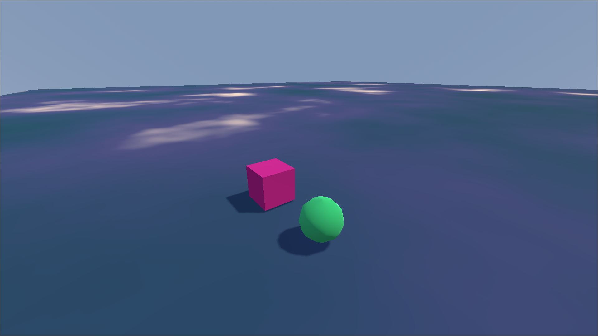
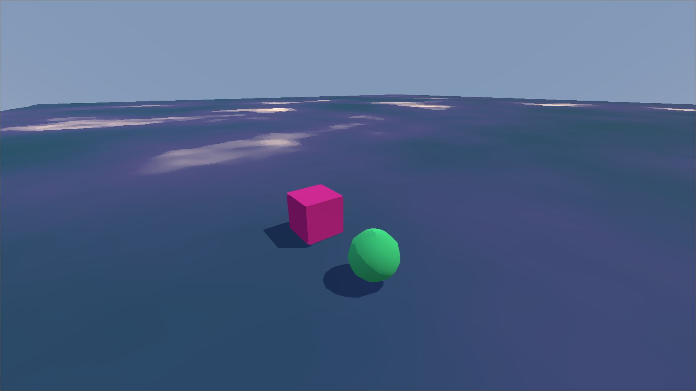

# Kuwahara Filter

Simple Drag and Drop Kuwahara filter effect in Godot with runtime value editing support.

For usage, you need to set the reference of the main camera in the script parameter.
Shaders variables are accessible from the same script.

Heavily inspired by [Acerola's video](https://www.youtube.com/watch?v=LDhN-JK3U9g) and [his implementation](https://github.com/GarrettGunnell/Post-Processing/tree/main/Assets/Kuwahara%20Filter)

# Example 

## Filter Disabled

## Filter Enabled
